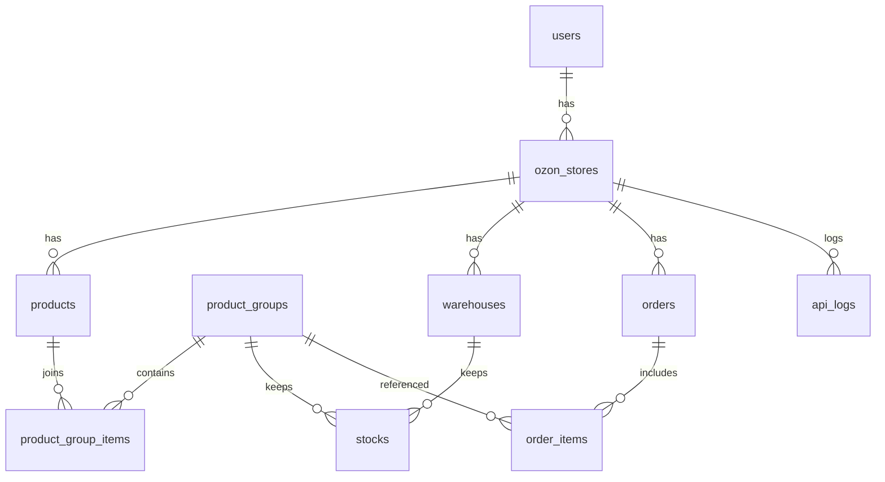

# Ozon Multi-Store SaaS

Проект реализует бэкенд портала для управления несколькими магазинами Ozon через Seller API. Реализованы все основные бизнес-требования: мультиарендность, группировка товаров, складские остатки по складам, резервирование заказов, очереди для всех операций с Ozon.

## Архитектура
- **FastAPI** — HTTP API и JWT-аутентификация.
- **PostgreSQL** — основное хранилище данных.
- **SQLAlchemy** — ORM.
- **Celery + Redis** — очереди для синхронизации остатков, цен, заказов и акций, с поддержкой ретраев и бэкоффа.
- **httpx + tenacity** — интеграция с Ozon Seller API с логированием всех вызовов и защитой от rate limit.
- **Nginx + systemd** — публикация и управление процессами (см. FastPanel раздел ниже).

### API-слои
- `app/api/routes/*` — маршруты для всех страниц портала: аутентификация, магазины, товары, группы, склады, остатки, заказы, акции, логи.
- `app/services/ozon_client.py` — клиент Ozon Seller API с логированием запросов/ответов и экспоненциальным бэкоффом.
- `app/services/stock_service.py` — бизнес-логика остатков и резервирования (поддержка статусов заказов).
- `app/workers/*` — Celery-задачи для очередей.

### ER-диаграмма


## Ключевая бизнес-логика
- **Мультиарендность**: все запросы фильтруются по текущему пользователю, магазины принадлежат только владельцу.
- **Сопоставление offer_id**: `GET /api/products/matches/{offer_id}` ищет совпадения без учета тире; объединение в группы выполняется только после ручного подтверждения.
- **Остатки по складам**: `stocks` хранят `available_qty` и `reserved_qty` для пары `product_group_id` + `warehouse_id` (FBO/FBS разделены типом склада).
- **Импорт остатков из файла**: CSV с `offer_id,warehouse,quantity`; требуются подтвержденные группы и существующий склад пользователя.
- **Резервирование заказов**: статусы `created/awaiting_registration` — резерв, `awaiting_delivery` — списание и снятие резерва, `cancelled` — возврат резерва. Резервы действуют на группу товаров, влияя на все магазины.
- **Очереди**: обновление остатков `/v2/products/stocks`, цен `/v1/product/import/prices`, синхронизация заказов и операций с акциями — только через Celery (`app/workers/tasks.py`). Ретраи и backoff настроены.

## Запуск локально
1. Создать `.env` (см. пример ниже).
2. Установить зависимости: `pip install -r requirements.txt`.
3. Запустить PostgreSQL и Redis.
4. Выполнить миграции (alembic) — можно создать таблицы через `Base.metadata.create_all(engine)` при первом запуске.
5. Запустить API: `uvicorn app.main:app --host 0.0.0.0 --port 8000`.
6. Запустить воркеры Celery: `celery -A app.workers.tasks.celery_app worker -l info`.

### Пример `.env`
```
SECRET_KEY=supersecret
POSTGRES_SERVER=localhost
POSTGRES_PORT=5432
POSTGRES_USER=ozon
POSTGRES_PASSWORD=ozonpwd
POSTGRES_DB=ozon_saas
REDIS_URL=redis://localhost:6379/0
```

## Описание API (основные эндпоинты)
- **/api/auth/register** — регистрация пользователя.
- **/api/auth/login** — получение JWT.
- **/api/stores** — создание и список магазинов.
- **/api/products** — CRUD товаров, поиск совпадений offer_id.
- **/api/product-groups** — создание групп (только подтвержденные связи), подтверждение товара в группе.
- **/api/warehouses** — управление складами.
- **/api/stocks** — получение и установка остатков, **/api/stocks/import** — импорт из файла.
- **/api/orders** — создание заказов с автоматической логикой резервов/списаний.
- **/api/promotions** — список акций, кандидаты, постановка в очередь на добавление/удаление товаров.
- **/api/logs/api** — журнал вызовов Seller API.

## Деплой на FastPanel (Nginx + systemd)
1. Подготовить сервер: установить PostgreSQL, Redis, Python 3.11+.
2. В FastPanel создать сайт (Nginx + Python), указать домен/поддомен.
3. Загрузить репозиторий в директорию сайта (`/var/www/<site>/`), создать виртуальное окружение `python -m venv venv` и активировать его.
4. Установить зависимости: `pip install -r requirements.txt`.
5. Создать файл `.env` в корне сайта с параметрами подключения.
6. Настроить `gunicorn` сервис (`/etc/systemd/system/ozon-api.service`):
```
[Unit]
Description=Ozon SaaS API
After=network.target
[Service]
User=www-data
Group=www-data
WorkingDirectory=/var/www/<site>
Environment="ENV_FILE=/var/www/<site>/.env"
ExecStart=/var/www/<site>/venv/bin/gunicorn -k uvicorn.workers.UvicornWorker app.main:app --bind 0.0.0.0:8000
Restart=always
[Install]
WantedBy=multi-user.target
```
   Запустить: `systemctl daemon-reload && systemctl enable --now ozon-api`.
7. Настроить Celery воркер (`/etc/systemd/system/ozon-celery.service`):
```
[Unit]
Description=Celery worker for Ozon SaaS
After=network.target
[Service]
User=www-data
Group=www-data
WorkingDirectory=/var/www/<site>
ExecStart=/var/www/<site>/venv/bin/celery -A app.workers.tasks.celery_app worker -l info
Restart=always
[Install]
WantedBy=multi-user.target
```
8. В Nginx (через FastPanel) настроить прокси на `127.0.0.1:8000`, включить HTTPS.
9. Проверить `https://<домен>/docs` — должна открыться Swagger UI для регистрации/логина, добавления первого магазина и дальнейшей работы.

## Тестовый сценарий запуска
1. Зарегистрировать пользователя через `/api/auth/register`.
2. Получить токен `/api/auth/login` и использовать в Authorization: Bearer.
3. Создать магазин `/api/stores` с `name`, `client_id`, `api_key`.
4. Создать склады и загрузить товары (или синхронизировать через Celery-задачи интеграции).
5. Создать группы товаров после подтверждения совпадений `offer_id`.
6. Импортировать остатки через `/api/stocks/import`.
7. Работать с заказами и акциями; все обновления остатков/цен/промо проходят через очередь Celery.
