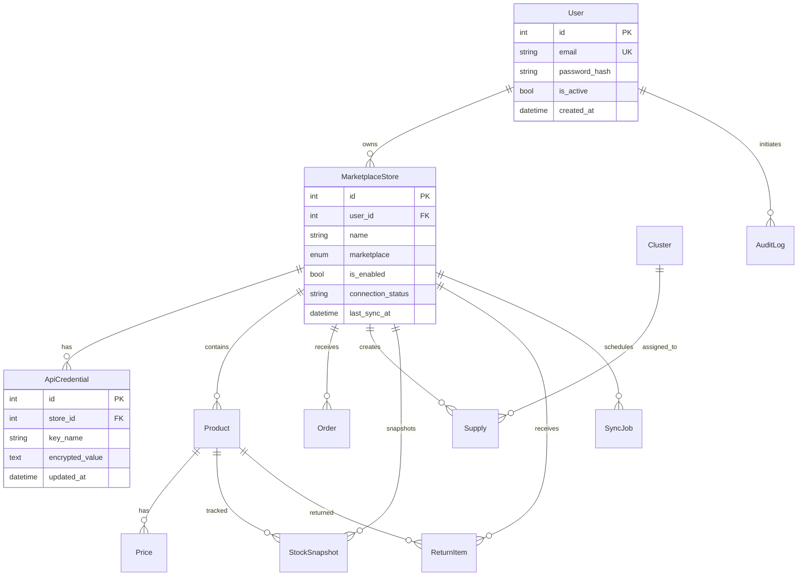

# MVP веб-приложения для селлеров маркетплейсов

## 1) Структура проекта

```text
avtoberg/
├── backend_fastapi/
│   ├── app/
│   │   ├── api/v1/endpoints/      # REST endpoints
│   │   ├── core/                  # конфиг, security
│   │   ├── db/                    # SQLAlchemy session/base
│   │   ├── models/                # сущности домена
│   │   ├── schemas/               # Pydantic DTO
│   │   ├── services/              # интеграции и доменная логика
│   │   └── workers/               # Redis worker jobs
│   ├── requirements.txt
│   └── .env.example
├── frontend_next/
│   ├── app/                       # маршруты и страницы Next.js (App Router)
│   ├── components/                # UI-компоненты
│   └── package.json
└── docs/
    └── mvp_architecture.md
```

## 2) ER-схема сущностей



> Пароли хранятся в hash (`bcrypt`), API-ключи — в шифрованном виде (`Fernet`).

## 3) Список API endpoint'ов (MVP)

### Auth
- `POST /api/v1/auth/register` — регистрация по email/password.
- `POST /api/v1/auth/login` — вход и получение JWT.

### Stores
- `GET /api/v1/stores` — список магазинов пользователя.
- `POST /api/v1/stores` — добавить магазин, сохранить ключи, проверить подключение, запустить первичную синхронизацию.
- `PATCH /api/v1/stores/{store_id}` — редактировать/отключить магазин.

### Planned endpoints (следующий этап)
- `GET /api/v1/prices`, `PATCH /api/v1/prices/{id}`, `POST /api/v1/prices/bulk-update`
- `GET /api/v1/orders`
- `GET /api/v1/fbo/supplies`, `GET /api/v1/fbo/recommendations`
- `GET /api/v1/analytics/sales`
- `GET /api/v1/stocks-returns/snapshot`
- `GET /api/v1/sync-jobs`

## 4) Roadmap MVP по этапам

1. **Foundation (1 неделя)**
   - FastAPI + PostgreSQL + Redis инфраструктура
   - auth, users, stores, credentials
   - шифрование ключей, hash паролей
2. **Core data sync (1–2 недели)**
   - проверка API-ключей Ozon/WB
   - initial sync в worker
   - журнал SyncJob и ошибки
3. **Cabinet pages (1–2 недели)**
   - Stores, Prices, Orders
   - фильтры по нескольким магазинам
4. **Operations analytics (1–2 недели)**
   - FBO + модуль рекомендаций
   - аналитика продаж и остатков через существующие Python-скрипты
5. **Hardening (1 неделя)**
   - audit log, retry/backoff, monitoring
   - подготовка к деплою и smoke tests

## 5) Каркас backend на FastAPI

- Реализованы базовые сущности домена в SQLAlchemy.
- Реализованы endpoints авторизации и магазинов.
- Добавлены модули безопасности (`hash/encrypt/JWT`).
- Добавлен worker для задач первичной синхронизации.
- Добавлены middleware-логирование и обработка ошибок.

## 6) Каркас frontend

- Next.js (App Router, TypeScript).
- Минималистичный layout + навигация по разделам.
- Заглушки страниц под все разделы MVP.

## 7) Базовые страницы и маршруты

- `/login`
- `/register`
- `/stores`
- `/prices`
- `/orders`
- `/fbo`
- `/analytics`
- `/stocks-returns`

## 8) Инструкции по деплою на Timeweb Cloud App Platform

1. **Подготовить репозиторий**
   - backend и frontend в одном репо (monorepo).
2. **Создать Postgres и Redis** в Timeweb Cloud.
3. **Создать 3 приложения**:
   - `api` (FastAPI, старт: `uvicorn app.main:app --host 0.0.0.0 --port 8000`)
   - `worker` (Redis worker, старт: `rq worker sync --url $REDIS_URL`)
   - `web` (Next.js, build/start команды стандартные)
4. **Переменные окружения**
   - `POSTGRES_DSN`, `REDIS_URL`, `SECRET_KEY`, `CREDENTIAL_ENCRYPTION_KEY`, `NEXT_PUBLIC_API_URL`
5. **Health checks**
   - API: `/health`
6. **CI/CD**
   - деплой по push в main.
7. **После деплоя**
   - выполнить smoke: регистрация → добавление магазина → проверка статуса → запуск sync-job.
